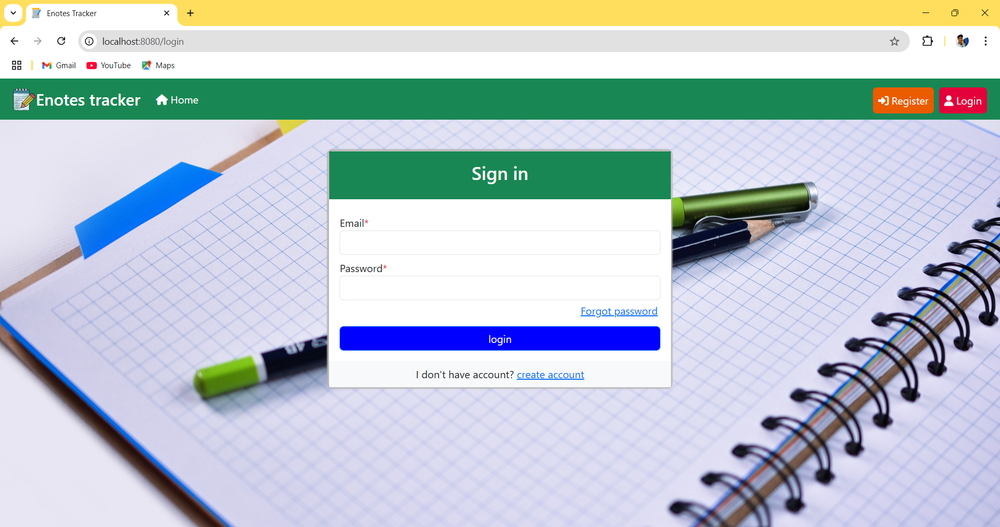
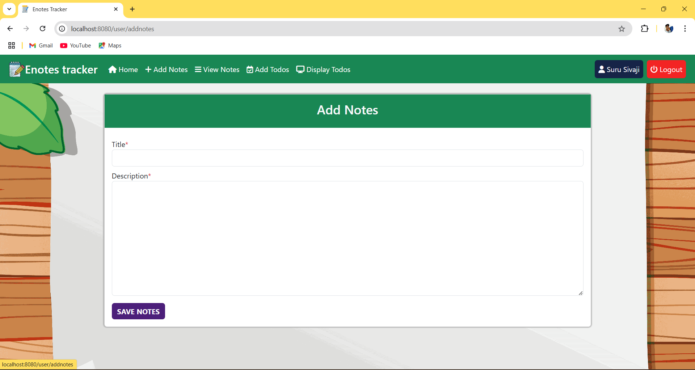
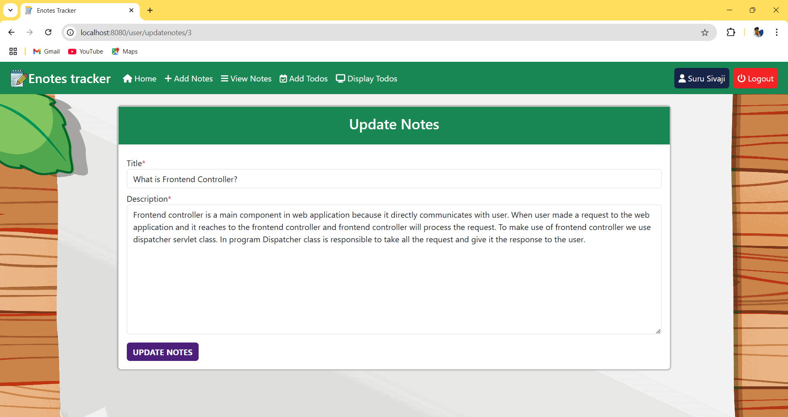
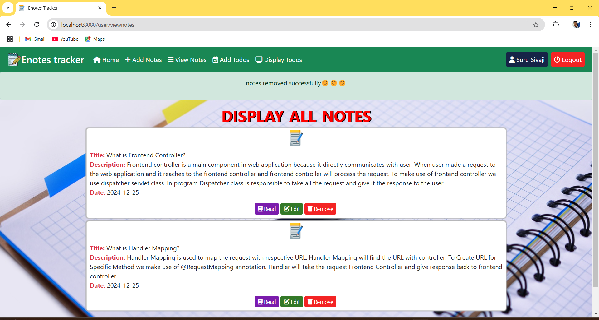
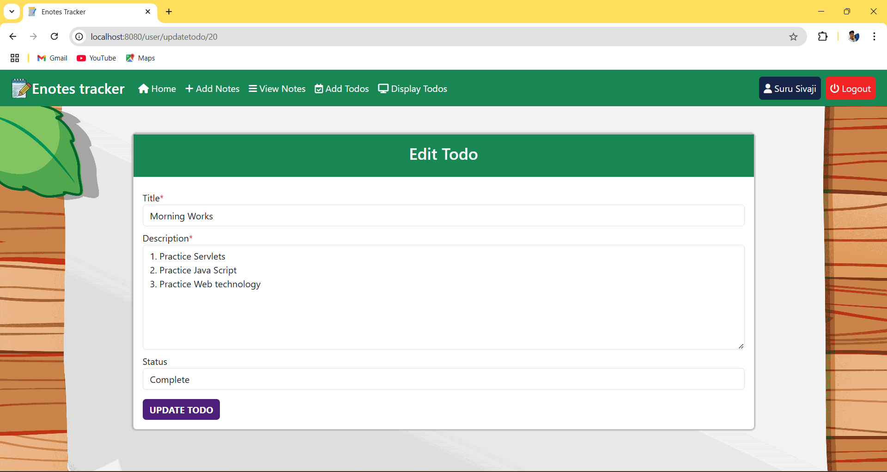
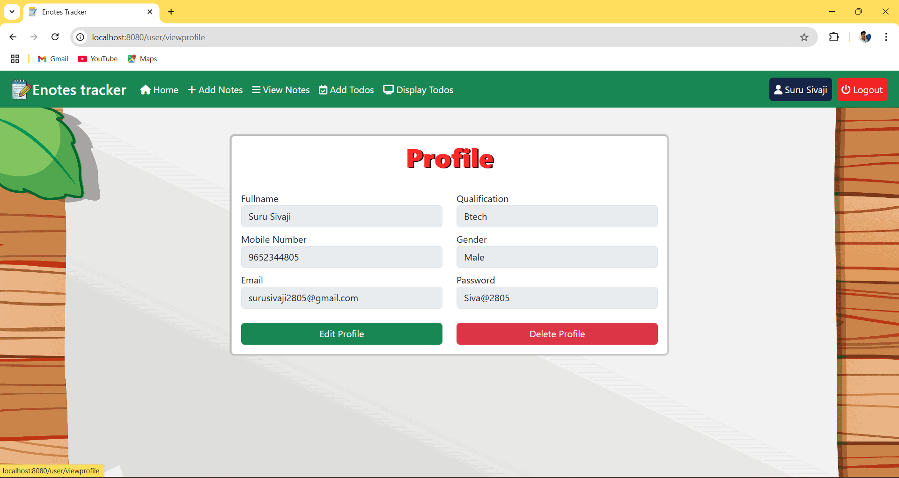
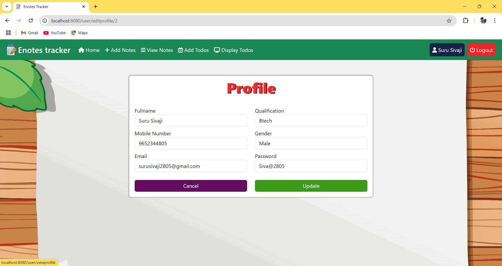
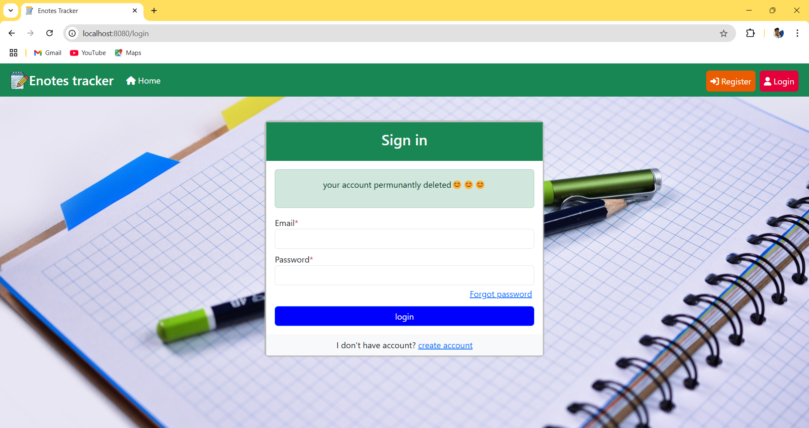
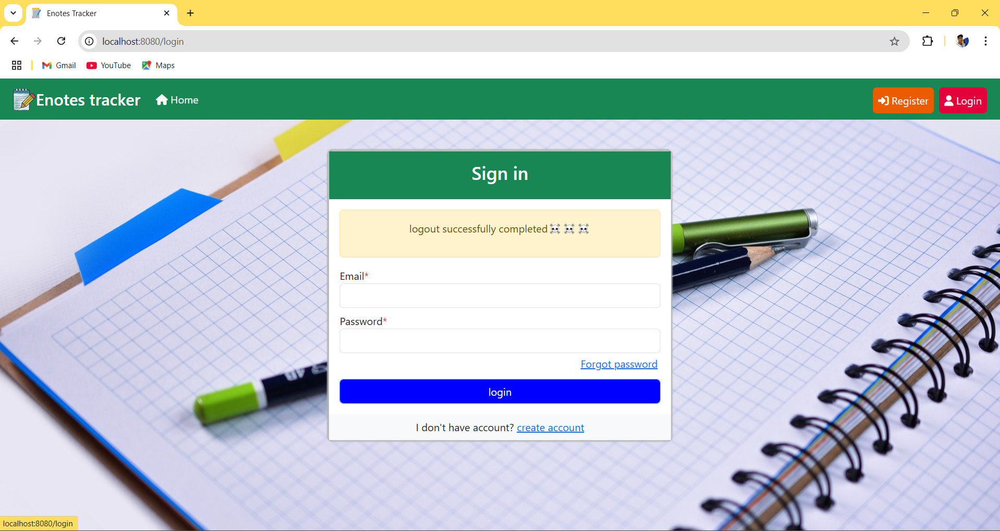

<h3 align="center">📝 ENotes Application</h3>

  <strong>ENotes Application</strong> is a feature-rich note-taking and user management system built using 
  <strong>Spring MVC</strong>, <strong>Spring Data JPA</strong>, <strong>HTML</strong>, <strong>CSS</strong>, 
  and <strong>JavaScript</strong>. This application empowers users to easily manage their notes, tasks, and account details.

<h3 align="center">📌 Key Features</h3>

  The application provides users with powerful tools for note-taking, task management, and account management:

  <ul>
    <li>🔐 <strong>User Registration & Login</strong>: Easy and secure account creation and login process.</li>
    <li>🔑 <strong>Password Recovery</strong>: Reset passwords with email and mobile number verification.</li>
    <li>🗒️ <strong>Notes Management</strong>: Organize information by adding, updating, and deleting notes.</li>
    <li>📋 <strong>Task Management</strong>: Add, view, edit, and remove tasks for better productivity.</li>
    <li>👤 <strong>User Profile Management</strong>: View, update, and delete profile information.</li>
    <li>💻 <strong>JavaScript Validations</strong>: Ensures data integrity across all forms.</li>
  </ul>

<h3 align="center">🏗️ Project Architecture</h3>

  Built using a clean and maintainable <strong>four-layer architecture</strong> for optimal code organization.

  <h4>1. Model Layer</h4>
  
Contains entity classes representing the database tables:

  <ul>
    <li><strong>User Entity</strong>: Stores user details.</li>
    <li><strong>Notes Entity</strong>: Stores individual notes, with a <strong>Many-to-One</strong> relationship to users.</li>
    <li><strong>Task Entity</strong>: Stores tasks with attributes like task title, description, and status, linked to users via a <strong>Many-to-One</strong> relationship.</li>
  </ul>

  <h4>2. Controller Layer</h4>
  
Handles <strong>URL mappings</strong>, routes to thymeleaf template engine, and manages HTTP requests and responses.

  <h4>3. Service Layer</h4>
  
Processes core business logic, including operations for managing users, notes, and tasks.

  <h4>4. Repository Layer</h4>
  
Defines repository interfaces for CRUD operations on database entities.

<h3 align="center">🚀 Core Functionalities</h3>

  <ul>
    <li>🔐 <strong>User Registration</strong>: Create accounts with basic user details.</li>
    <li>🔑 <strong>User Login</strong>: Securely access the application.</li>
    <li>❓ <strong>Forgot Password</strong>: Reset passwords using mobile and email validation.</li>
    <li>🗒️ <strong>Notes Management:</strong>
      <ul>
        <li>✅ <strong>Add Notes:</strong> Create new notes to store personal information.</li>
        <li>📖 <strong>View Notes:</strong> Display the list of all notes created.</li>
        <li>✏️ <strong>Edit Notes:</strong> Modify existing notes as needed.</li>
        <li>❌ <strong>Remove Notes:</strong> Delete notes that are no longer relevant.</li>
      </ul>
    </li>
    <li>📋 <strong>Task Management:</strong>
      <ul>
        <li>✅ <strong>Add Task:</strong> Create new tasks with titles and descriptions.</li>
        <li>📖 <strong>View Tasks:</strong> Display the list of all tasks created.</li>
        <li>✏️ <strong>Edit Tasks:</strong> Modify existing tasks to update their details or status.</li>
        <li>❌ <strong>Remove Tasks:</strong> Delete tasks that are no longer required.</li>
      </ul>
    </li>
    <li>👤 <strong>User Profile:</strong>
      <ul>
        <li>👁️ <strong>View Profile:</strong> Display user profile details.</li>
        <li>✏️ <strong>Edit Profile:</strong> Update personal information to keep it current.</li>
        <li>🗑️ <strong>Delete Profile:</strong> Permanently delete the user profile and associated details from the application.</li>
      </ul>
    </li>
  </ul>

<h3 align="center">🛠️ How It Works</h3>

  <strong>ENotes Application</strong> is developed using <strong>Spring MVC</strong>, <strong>Thymeleaf</strong>, 
  <strong>Spring Data JPA</strong>, <strong>CSS</strong>, <strong>JavaScript</strong>, and <strong>MySQL</strong>. 
  The application provides a seamless and user-friendly experience for note, task, and account management:

  <ol>
    <li>
      <strong>Registration:</strong> New users can register by providing their details such as email and mobile number. Upon successful registration, all user details are securely stored in the database.
    </li>
    <li>
      <strong>Login:</strong> Users can log in with their credentials to access their account. Authentication ensures a secure experience.
    </li>
    <li>
      <strong>Password Recovery:</strong> If a user forgets their password, they can reset it through the password recovery feature. The application verifies the provided email and mobile number. If both are correct, the user is allowed to reset their password. Otherwise, access is denied.
    </li>
    <li>
      <strong>Perform Operations:</strong> After logging in, users can manage their notes, tasks, and profile. The operations include:
      <ul>
        <li>🗒️ <strong>Notes Management:</strong>
          <ul>
            <li>✅ <strong>Add Notes:</strong> Create new notes to store personal information.</li>
            <li>📖 <strong>View Notes:</strong> Display the list of all notes created.</li>
            <li>✏️ <strong>Edit Notes:</strong> Modify existing notes as needed.</li>
            <li>❌ <strong>Remove Notes:</strong> Delete notes that are no longer relevant.</li>
          </ul>
        </li>
        <li>📋 <strong>Task Management:</strong>
          <ul>
            <li>✅ <strong>Add Task:</strong> Create new tasks with titles and descriptions.</li>
            <li>📖 <strong>View Tasks:</strong> Display the list of all tasks created.</li>
            <li>✏️ <strong>Edit Tasks:</strong> Modify existing tasks to update their details or status.</li>
            <li>❌ <strong>Remove Tasks:</strong> Delete tasks that are no longer required.</li>
          </ul>
        </li>
        <li>👤 <strong>Profile Management:</strong>
          <ul>
            <li>👁️ <strong>View Profile:</strong> Display user profile details.</li>
            <li>✏️ <strong>Edit Profile:</strong> Update personal information to keep it current.</li>
            <li>🗑️ <strong>Delete Profile:</strong> Permanently delete the user profile and associated details from the application.</li>
          </ul>
        </li>
      </ul>
    </li>
  </ol>

<h3 align="center">📋 Pre-requisites</h3>

  <ul>
    <li>Java Development Kit (JDK) 8 or higher installed</li>
    <li>Apache Tomcat server or equivalent</li>
    <li>MySQL Database</li>
    <li>Basic knowledge of Spring Framework</li>
  </ul>

<h3 align="center">📖 How to Use This Repository</h3>

Follow these steps to set up and use the application locally:

  <ol>
    <li>
      <strong>Clone the Repository:</strong> Use the following command to clone the repository:
      <pre><code>git clone https://github.com/your-repo/enotes-application.git</code></pre>
    </li>
    <li>
      <strong>Import Project:</strong> Open the project in your preferred IDE (e.g., IntelliJ IDEA, Eclipse) and import it as a Maven project.
    </li>
    <li>
      <strong>Configure Database:</strong> Update the <code>application.properties</code> file with your MySQL database credentials.
    </li>
    <li>
      <strong>Build & Run:</strong> Build the project using Maven and run the application on the Tomcat server.
    </li>
    <li>
      <strong>Access the Application:</strong> Open a web browser and navigate to <code>http://localhost:8080</code> to use the application.
    </li>
  </ol>

<h3 align="center">📸 Screenshots</h3>

Below are sample screenshots showcasing the ENotes Application:

  <h4>1. Index Page</h4>
  
  <h4>2. Registration Page</h4>
  
   <h4>3. Login Page</h4>
  
   <h4>4. Forgot Password Page</h4>
  
   <h4>5. Reset Password Page</h4>
  
   <h4>6. Home Page</h4>
  
   <h4>7. Add Notes Page</h4>
  
   <h4>8. View Notes Page</h4>
  
   <h4>9. Read Notes Page</h4>
  
   <h4>10. Edit Notes Page</h4>
  
   <h4>11. Remove Notes Page</h4>
  
   <h4>12. Add Task Page</h4>
  
  <h4>13. View Tasks Page</h4>
  
   <h4>14. Read Task Page</h4>
  
   <h4>15. Update Task Page</h4>
  
   <h4>16. Remove Task Page</h4>
  
   <h4>17. View Profile Page</h4>
  
   <h4>18. Update Profile Page</h4>
  
   <h4>19. Delete Account Page</h4>
  
   <h4>20. Logout Page</h4>
  

<h3 align="center">😊 Enjoy Using ENotes Application!</h3>
